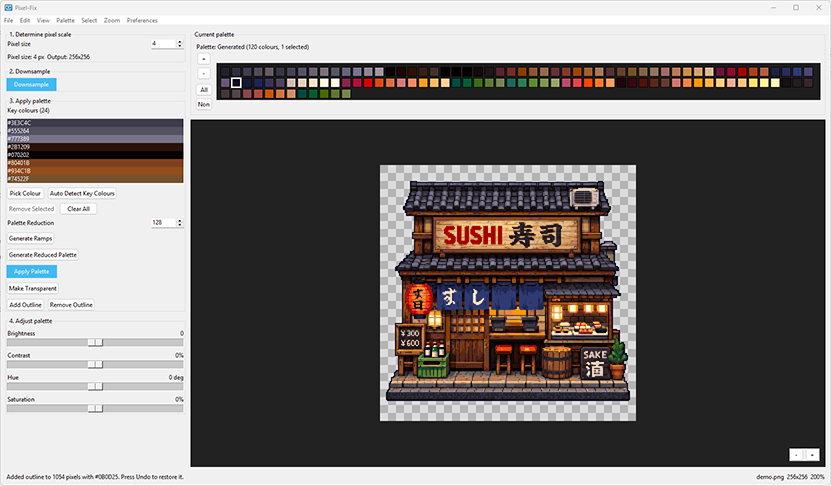

<p align="center">
  
</p>

# pixel-fix

`pixel-fix` is a desktop-first tool for cleaning up pixel-art-like PNGs into something easier to edit, palette, and export.

The current app is a Windows-friendly Tkinter GUI built around a simple staged workflow:

1. Determine pixel scale
2. Downsample
3. Apply palette
4. Adjust palette

The GUI is the main product. The CLI entrypoint still exists, but the desktop app is the authoritative workflow.

## Screenshot



## Quick Start

### Install for development

```bash
python -m pip install -e .
```

### Launch the GUI

From the repository root:

```bash
python -c "from pixel_fix.gui import main; raise SystemExit(main())"
```

If you are using the project virtual environment directly on Windows:

```powershell
.\.venv\Scripts\python.exe -c "from pixel_fix.gui import main; raise SystemExit(main())"
```

If the script entrypoints are installed and on `PATH`, this also works:

```bash
pixel-fix-gui
```

## What The App Does

From one interface, you can:

- Open a PNG and switch between `Original` and `Processed` views.
- Set a manual `Pixel size` and downsample with:
  - `Nearest Neighbor`
  - `Bilinear Interpolation`
  - `RotSprite`
- Build palettes in several ways:
  - generate a reduced palette with `Median Cut` or `K-Means Clustering`
  - load built-in `.gpl` palettes from the repository
  - load external `.gpl` or legacy `.json` palettes
- Edit the current palette directly:
  - add colours from the original image
  - add colours by hex code
  - merge selected swatches into one perceptual median colour
  - append ramps from selected swatches using the current ramp settings
  - remove selected swatches
  - sort the current palette by lightness, hue, saturation, chroma, or temperature
- Select palette colours quickly:
  - click, `Shift`-click, `Ctrl`-click, and `Ctrl`-drag in the palette strip
  - `All` / `None` buttons
  - `Select` menu commands based on lightness, saturation, chroma, temperature, and hue buckets
  - `Selection Threshold` preference from `10%` to `100%`
- Adjust the whole palette or just the selected swatches with:
  - `Brightness`
  - `Contrast`
  - `Hue`
  - `Saturation`
- Apply the current palette only when you click `Apply Palette`.
- Remove connected regions to transparency with the processed-image transparency picker.
- Add a 1-pixel exterior outline around the current processed silhouette using one selected palette colour.
- Remove a 1-pixel exterior outline by eroding the outside edge to transparency.
- Use dithering when applying palettes:
  - `None`
  - `Ordered (Bayer)`
  - `Blue Noise`
- Save the processed image as PNG.
- Save the current palette as `.gpl`.

## Recommended Workflow

1. Open an image.
2. Set the pixel size in `1. Determine pixel scale`.
3. Click `Downsample`.
4. Build or load a palette:
   - click `Generate Reduced Palette`
   - load a built-in or external palette
5. Optionally sort, select, merge, ramp, add, remove, or adjust palette colours.
6. Click `Apply Palette`.
7. Optionally use `Make Transparent`, `Add Outline`, or `Remove Outline` on the processed result.
8. Compare the result against the original, then save the image or palette.

Important behavior:

- palette generation, palette sorting, palette selection, and palette adjustments update the `Current palette` preview immediately
- the processed image does not change until you click `Apply Palette`

## Current GUI Layout

### 1. Determine pixel scale

The app currently uses an explicit `Pixel size` value rather than automatic grid detection in the main workflow.

If the source image is `512x512` and `Pixel size` is `2`, the working image becomes `256x256`.

### 2. Downsample

Downsampling is handled in [`src/pixel_fix/resample.py`](src/pixel_fix/resample.py). The three resize modes behave differently:

- `Nearest Neighbor`
  - keeps hard source samples
  - best when the source is already very blocky
- `Bilinear Interpolation`
  - smooths during reduction
  - useful when the source is noisy or slightly anti-aliased
- `RotSprite`
  - uses a practical RotSprite-style approximation to protect diagonals before resampling back down

### 3. Apply palette

This stage is where most of the toolset lives.

#### Selection-driven palette workflow

The palette editor is selection-driven. Use `Generate Reduced Palette` or load a palette first, then select swatches in the `Current palette` strip and edit them directly before apply.

Controls in this stage let you:

- generate a reduced palette from the downsampled image
- apply the current palette to the processed image

#### Palette strip editing

The `Current palette` strip is live and editable before apply:

- `+` adds a colour to the current palette
- `-` removes selected colours
- `Merge` replaces the selected swatches with one perceptual median colour
- `Ramp` appends a full ramp for each selected swatch using the current ramp settings
- `All` selects every swatch
- `None` clears selection

Selection-aware editing is built in:

- if no swatches are selected, palette adjustments affect the full current palette
- if swatches are selected, palette adjustments only affect that subset

#### Palette menu tools

The `Palette` menu currently includes:

- input and output colour-mode controls
- built-in palette browser
- add-colour tools
- sort current palette
- load palette
- save current palette

The `Select` menu lets you select colours in the current palette by:

- dark/light lightness
- low/high saturation
- low/high chroma
- cool/warm temperature
- hue buckets: red, yellow, green, cyan, blue, magenta

The selection count is controlled by `Preferences > Selection Threshold`.

#### Processed-image tools

After a processed image exists, you can:

- `Make Transparent`
  - click the processed image to remove only the connected region under the cursor
- `Add Outline`
  - requires exactly one selected swatch in the current palette
  - adds a 1-pixel outline around the outside silhouette only
- `Remove Outline`
  - removes the outer inside edge of the current silhouette by making it transparent

These tools work through the processed image's per-pixel alpha mask, so saved PNGs preserve the transparency.

### 4. Adjust palette

The adjustment stage uses perceptual palette operations from [`src/pixel_fix/palette/adjust.py`](src/pixel_fix/palette/adjust.py):

- `Brightness`
- `Contrast`
- `Hue`
- `Saturation`

These adjustments modify the current palette preview first. The image only updates when you click `Apply Palette`.

## Preferences

The current `Preferences` menu includes:

- checkerboard background
- resize method
- palette reduction method
- colour-ramp options:
  - ramp steps
  - ramp contrast
- dithering method
- selection threshold

## Shortcuts

- `Ctrl+O`: open image
- `Ctrl+S`: save processed image
- `Ctrl+Shift+S`: save processed image as
- `Ctrl+Z`: undo
- `Ctrl+1`: original view
- `Ctrl+2`: processed view
- `Ctrl+0`: fit zoom
- `F5`: downsample
- `F6`: apply palette

## Saved Data

Per-user app data is stored outside the repository under `%APPDATA%\\pixel-fix`.

That includes:

- settings
- recent files
- process log

## Build A Windows Executable

The repository includes PNG icon source files plus a generated `pixel-fix.ico` for Windows packaging.

### Build with the included PowerShell script

```powershell
.\scripts\build_windows_exe.ps1
```

### Manual build

```bash
python -m pip install pyinstaller
python -m PyInstaller --noconfirm --clean --onefile --windowed --name pixel-fix-gui --paths src --icon pixel-fix.ico --add-data "pixel-fix.ico;." --add-data "ico-32.png;." scripts/pyinstaller_gui_entry.py
```

Expected output:

```text
dist/pixel-fix-gui.exe
```

## CLI Status

The package still exposes:

- `pixel-fix`
- `pixel-fix-gui`

But the GUI is the most complete and current interface.

## Project Structure

- [`src/pixel_fix/gui`](src/pixel_fix/gui): Tkinter app, preview logic, persistence, GUI-side processing helpers
- [`src/pixel_fix/resample.py`](src/pixel_fix/resample.py): downsampling and RotSprite-style resampling
- [`src/pixel_fix/palette`](src/pixel_fix/palette): palette generation, adjustment, sorting, selection, quantization, loading, saving
- [`src/pixel_fix/pipeline.py`](src/pixel_fix/pipeline.py): pipeline integration
- [`tests`](tests): unit tests for GUI behavior, palette logic, processing, and pipeline code
